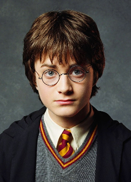
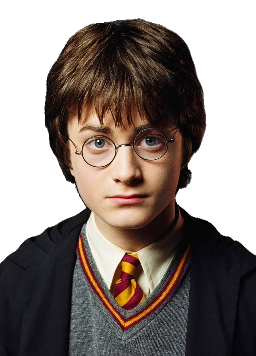
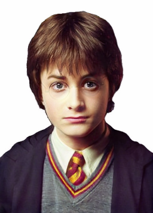

# removal of eye glasses (web-app)

Deployment of image to image translation model as a web-app.

#### model details

> Dataset - [aligned CelebA](https://drive.google.com/drive/folders/0B7EVK8r0v71pWEZsZE9oNnFzTm8)

* I used [Contrastive Unpaired Translation (CUTGAN)](https://github.com/taesungp/contrastive-unpaired-translation) for training the model. 

* Divided the data-set into two parts  *with eye-glasses and without eye-glasses* based on provided attributes list. 

* For reducing complexity, [portrait segmentation model](https://github.com/anilsathyan7/Portrait-Segmentation) is used to extract region of person and send it to the generative model as input. 

  

| original                      | portrait                      | model output                  |
| ----------------------------- | ----------------------------- | ----------------------------- |
|  |  |  |

[CARN Model (Fast, Accurate, and Lightweight Super-Resolution with Cascading Residual Network)](https://github.com/nmhkahn/CARN-pytorch) for up-scaling the output image.

#### Dependencies
* Python 3.5+
* PyTorch
* Tensorflow-lite (for portrait segmentation)
* Starlette

Run the web-app locally using command - `python app/server.py serve`

#### References:

[CycleGAN](https://github.com/junyanz/pytorch-CycleGAN-and-pix2pix)

[Contrastive Unpaired Translation (CUTGAN)](https://github.com/taesungp/contrastive-unpaired-translation)

[Portrait Segmentation models by Anil Sathyan](https://github.com/anilsathyan7/Portrait-Segmentation)

[Waifu2x-PyTorch implementation](https://github.com/yu45020/Waifu2x)

